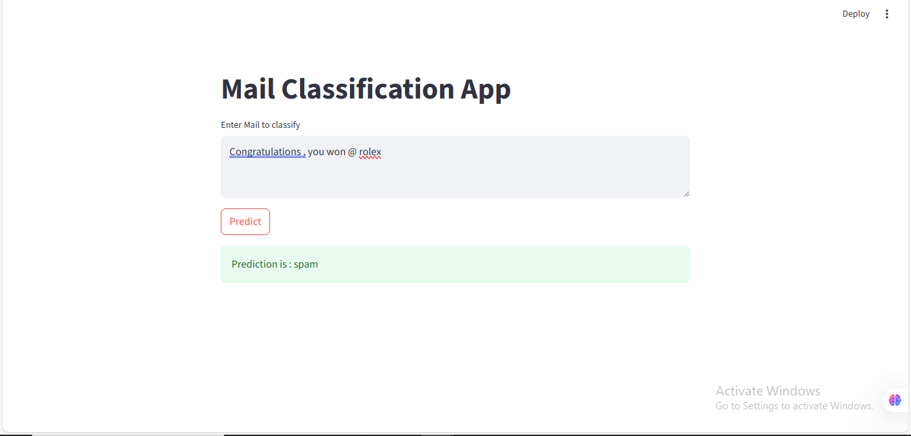
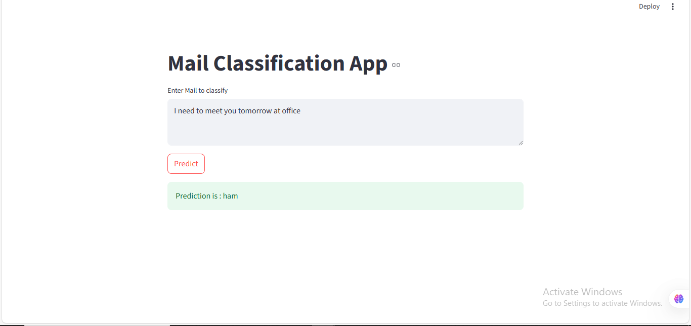

# Text Classification with Streamlit and Docker

This project is a complete pipeline for text classification using a trained machine learning model served through a Streamlita web app. The app is containerized with Docker for easy deployment.

## Features

- Clean UI for inputting and classifying text
- Trained ML model using Scikit-learn
- Simple preprocessing pipeline
- Dockerized for production use

## Demo

 
 
